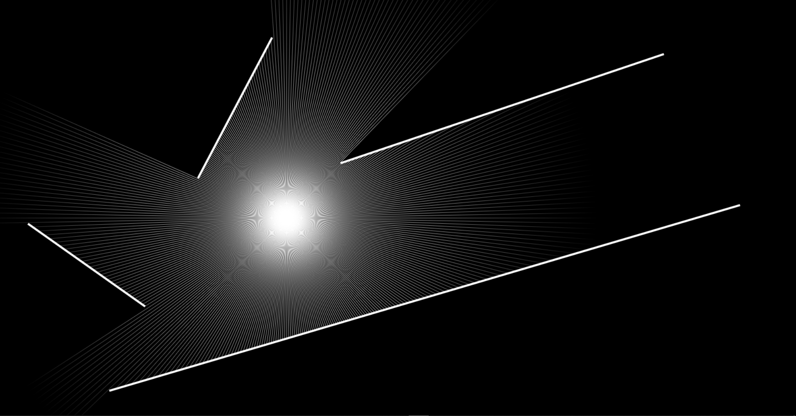

# Raycast

A very simple 2D Raycasting experiment using `HTML5 Canvas`.



## Getting Started

Simply run the web app by running

```bash
yarn # or npm install

yarn dev # or npm run dev
```

## Links

- [Line–line intersection](https://en.wikipedia.org/wiki/Line%E2%80%93line_intersection)
- [Coding Challenge #145: 2D Raycasting (by: The Coding Train)](https://www.youtube.com/watch?v=TOEi6T2mtHo)

## Support

If this project is helpful to you, please consider supporting me by donating or just give this project a 🌟

<a href="https://www.buymeacoffee.com/hotpotato" target="_blank"></a>
